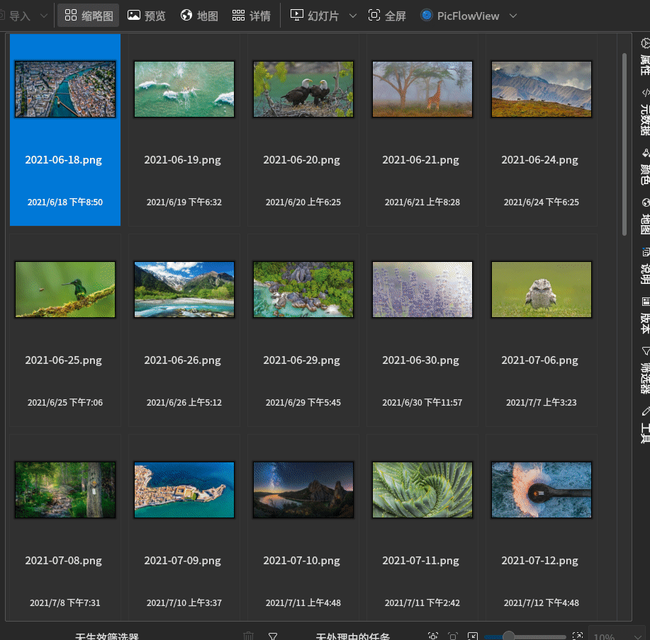

# 截图




# 构建

此项目依赖于以下组件（Fedora）：

- spdlog-devel
- digikam-devel
- qt5-qtbase-devel
- c++ 17
- cmake

要构建并安装，请执行以下指令：

```bash
cmake -B build -DCMAKE_BUILD_TYPE=Release
cmake --build build
sudo cmake --install build
```
